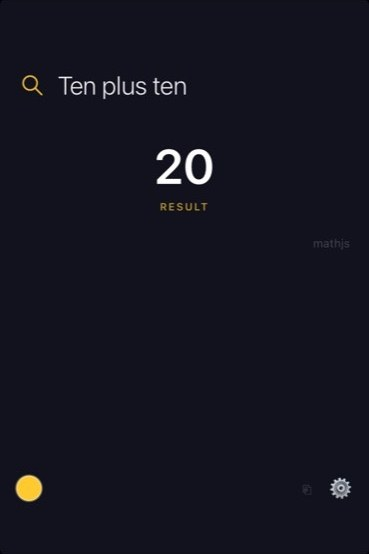
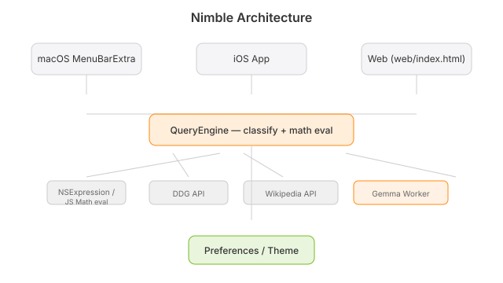

# Nimble

  [](https://github.com/nulljosh/nimble)

Instant-answer search for macOS, iOS, and the web. Classifies your query — math, factual, or definition — and answers instantly. Math runs fully offline.

**[nimble.heyitsmejosh.com →](https://nimble.heyitsmejosh.com)**

Inspired by the original [Nimble](https://github.com/Maybulb/Nimble) (Electron + Wolfram|Alpha, deprecated 2020) — rebuilt native, from scratch.

## Features

- **Smart classification** — math / factual / definition intent detection
- **Instant answers** — DuckDuckGo → Wikipedia, prioritized for questions
- **Offline math** — arithmetic, trig, sqrt, log, powers, pi
- **8 themes** — orange, red, yellow, green, blue, purple, pink, contrast
- **In-app updates** — checks GitHub Releases daily, plus a manual check in Preferences
- No API keys required · no telemetry · 34 tests

> MenuBarExtra disabled (macOS Tahoe beta bug). Re-enabled when the SDK stabilizes.

## Platforms

| | |
|---|---|
| macOS | Native SwiftUI menu bar app |
| iOS | Native SwiftUI app |
| Web | Static page, no backend — [web/index.html](web/index.html) |



## Installing the Mac app

Download the latest `.zip` from [Releases](https://github.com/nulljosh/nimble/releases/latest), unzip, drag `Nimble.app` to `/Applications`.

Releases from v1.0.1 on are Developer ID-signed and notarized, so they open on first
launch. The v1.0.0 build was signed with a development certificate only — macOS
quarantines it and it has to be approved under System Settings → Privacy & Security →
"Open Anyway". If you are on that build, updating clears it.

Maintainers: build releases with `scripts/release-macos.sh`, which signs, notarizes,
staples and packages in one pass. It needs a Developer ID Application certificate and a
`notarytool` credential profile — see the header of the script.

## Architecture



See [roadmap.md](roadmap.md) for open work.

## Development

```bash
xcodegen generate && open Nimble.xcodeproj
```

Requires Xcode + xcodegen.

## License

MIT 2026 Joshua Trommel

## Whitepaper

[Technical whitepaper](WHITEPAPER.md)
