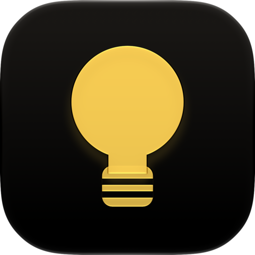
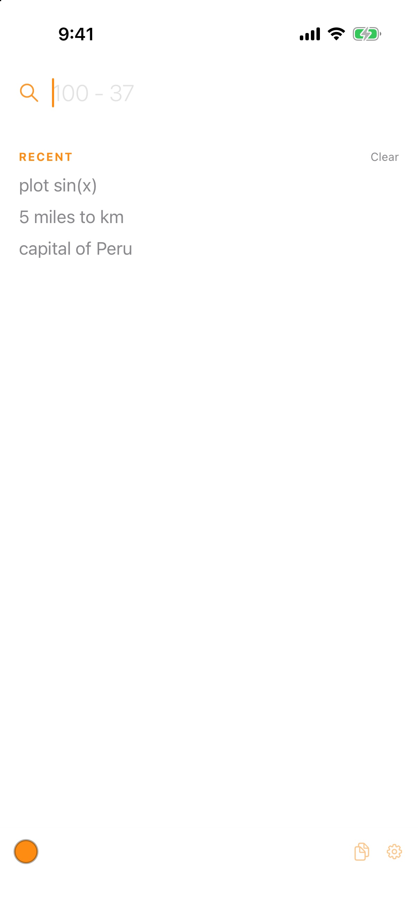
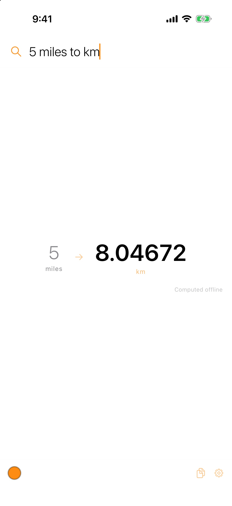
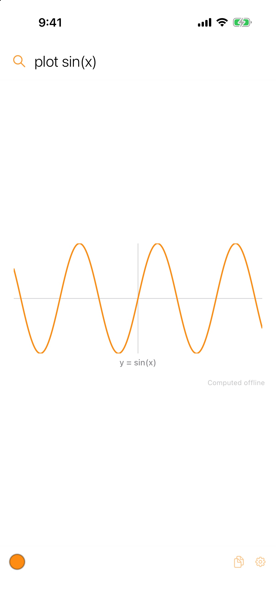
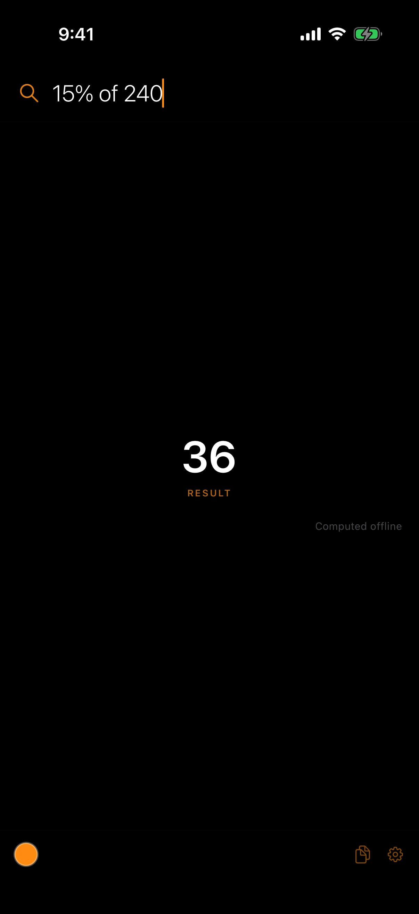
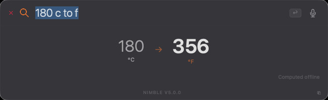
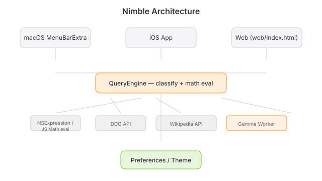

# Nimble

  [](https://github.com/nulljosh/nimble)

Ask a question. Get one sentence back.

Math, units and graphs answer on the device. Everything else goes to two open models at once, and DuckDuckGo and Wikipedia catch what they miss. No API keys, no accounts, no telemetry.

**[nimble.heyitsmejosh.com →](https://nimble.heyitsmejosh.com)** · **[Open the web app →](https://nimble.heyitsmejosh.com/app)**

<p>




</p>


## Get it

| | |
|---|---|
| iPhone and Mac | [App Store](https://apps.apple.com/app/nimble-answers/id6807858746) |
| Mac, direct | [Latest release](https://github.com/nulljosh/nimble/releases/latest), signed and notarized. ⌥Space summons it |
| Windows, Android | `.msi` and `.apk` on the same release |
| Web | [nimble.heyitsmejosh.com/app](https://nimble.heyitsmejosh.com/app), works offline once loaded |
| Terminal | `swift build && ./.build/debug/nimble-tui "your question"` |

## How it answers

1. Units, math and graphs: evaluated on the device. `5 miles to km`, `15% of 240`, `plot sin(x)`.
2. Dictionary, weather, local time and currency: pattern-gated live sources.
3. Everything else: Gemma and Qwen3 run side by side on Cloudflare Workers AI through `worker/worker.js`. Agree and you get it; disagree and the two are folded into one sentence. Numbers are cross-checked against DuckDuckGo. Both give up and Wikipedia answers.

Agents get the same engine at `https://nimble.heyitsmejosh.com/api/answer?q=5+miles+to+km` and over MCP at `https://nimble.heyitsmejosh.com/mcp`. Tools: answer, convert, math, graph.

Every answer names its source. Light and dark follow the system. 8 accent themes.

## Development

```bash
xcodegen generate && open Nimble.xcodeproj   # macOS + iOS
node --test 'test/*.test.*js'               # web engine
cd worker && npx wrangler deploy             # answer proxy
scripts/release-macos.sh                     # signed, notarized Mac zip
```

The landing page is the web app: `docs/index.html` + `docs/app.html` + `docs/engine.js`, deployed to Cloudflare Pages on push. The app icon is `Nimble.icon`, an Icon Composer bundle.



Open work is in [roadmap.md](roadmap.md). Design notes in the [whitepaper](WHITEPAPER.md).

## License

MIT 2026 Joshua Trommel
